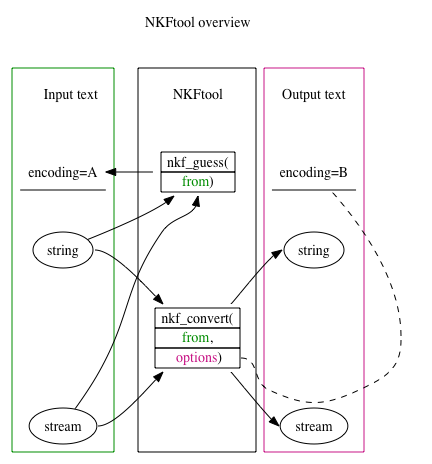

# NKFtool

NKFtool: Julia package for converting encodings in Japanese texts using nkf
====================================

NKFtool is a [Julia](https://julialang.org) package for guessing and converting
encodings in Japanese text.  This is the wrapper module
to Network kanji (Japanese characters) filter,
aka [nkf](https://osdn.net/projects/nkf/),
and provides the interface to use nkf from Julia.

[](https://hsugawa8651.github.io/NKFtool.jl/stable)
[](https://hsugawa8651.github.io/NKFtool.jl/dev)
[](https://travis-ci.com/hsugawa8651/NKFtool.jl)
[](https://codecov.io/gh/hsugawa8651/NKFtool.jl)

Overview
------------




```julia-repl
julia> nkf_convert( raw"こんにちわ", "-s") |> nkf_guess
"Shift_JIS"
```

Documentation
------------

- [**STABLE**](https://hsugawa8651.github.io/NKFtool.jl/stable) &mdash; **documentation of the most recently tagged version.**
- [**DEVEL**](https://hsugawa8651.github.io/NKFtool.jl/dev) &mdash; *documentation of the in-development version.*


Installation
------------

NKFtool requires nkf to be installed in your system. Major Unix-like operating systems offer its precompiled version in their package management systems.

NKFtool also requires Julia v1.0 or above.

To install NKFtool using Julia's packaging system, enter Julia's package manager prompt with `]`, and run

    (v1.1) pkg> add NKFtool

Tests
------------

To run the tests, enter Julia's package manager with ] and run

(v1.1) pkg> add NKFtool

The current test codes are prepared
for ["Network Kanji Filter Version 2.1.5 (2018-12-15)"](https://osdn.net/projects/nkf/releases/70406).

Status
------------
The current package is tested against Julia 1.1 and above on Linux and MacOSX.


## Contributions

Contributions are very welcome, as are feature requests and suggestions. Please open an [issue](https://github.com/hsugawa8651/NKFtool.jl/issues) if you encounter any problems.

## LICENSE

This software is released under the MIT License, see LICENSE.
