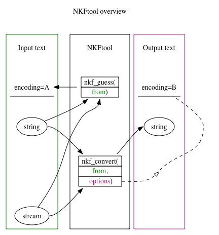

# Guide

## Overview



## Installation

### nkf

NKFtool requires nkf to be installed in your system.
Major Unix-like operating systems offer its precompiled version
in their package management systems.

For MacOSX, nkf can be installed with Homebrew:

```
brew install nkf
```

### NKFtool

NKFtool also requires Julia v1.0 or above.

To install NKFtool using Julia's packaging system, enter Julia's package manager prompt with `]`, and run

```
    (v1.1) pkg> add NKFtool
```


## Convert a string

The `nkf` command can guess the encoding of Japanese texts.

To guess the encoding of a string `from`, use [`nkf_guess(from::String)`](@ref)

```julia-repl
julia> nkf_guess(raw"こんにちわ")
"UTF-8"

julia> nkf_convert( raw"こんにちわ", "-j") |> nkf_guess
"ISO-2022-JP"

julia> nkf_convert( raw"こんにちわ", "-e") |> nkf_guess
"EUC-JP"

julia> nkf_convert( raw"こんにちわ", "-s") |> nkf_guess
"Shift_JIS"
```

To convert the encoding of a string `from`, use [`nkf_convert(from::String, options="-w -m0")`](@ref).

The second parameter `options` is passed to the `nkf` command
to specify its action.

The default of `options` is `-w -m0` (output encoding is UTF-8, no MIME decode), which keeps the encoding of Julia's standard strings, i.e., UTF-8.

```julia-repl
julia> nkf_convert(raw"こんにちわ")
"こんにちわ"

julia> nkf_convert(raw"こんにちわ", "-w -m0")
"こんにちわ"
```

To convert the encoding, the output encoding option,
only one of `-j` (ISO-2022-JP), `-s` (Shift\_JIS),
`-e` (EUC-JP) and `-w` (UTF-8), should be specified.
The input encoding option, only one of `-J`, `-S`, `-E` and `-W`, may be specified if you know the encoding of the input string `from`.

Because in Julia strings in the encoding other than UTF-8 are not printable ,
it is a good practice to encode them to printable characters with e.g. `Base64.base64encode()`, as follows:

```julia-repl
julia> using Base64

julia> nkf_convert( raw"こんにちわ", "-j") |> base64encode
"GyRCJDMkcyRLJEEkbxsoQg=="

julia> String(base64decode(ans)) |> nkf_convert
"こんにちわ"
```

## Convert a text stream

`nkf_guess` function accepts input text stream for the first argument.

`nkf_convert` function also accepts
input text stream for the first argument,
which returns the output text stream.

See the following code using [`nkf_guess(from::IO)`](@ref)
to guess the encoding of a text file.

```julia-repl
julia> open("hello_sjis.txt","w") do f
           print(f, nkf_convert(raw"こんにちわ", "-s"))
       end
       #
       encoding=open("hello_sjis.txt") do f
           nkf_guess(f)  # <==
       end
"Shift_JIS"
```

The following code using [`nkf_convert(from::IO, options="-w -m0")`](@ref)
is to convert a text file from Shift\_JIS encoding to UTF-8 encoding and
to read it as Julia's string.


```julia-repl
julia> hello_utf=open("hello_sjis.txt") do f
           nkf_convert(f, "-w -m0")  # <==
       end
"こんにちわ"
```
